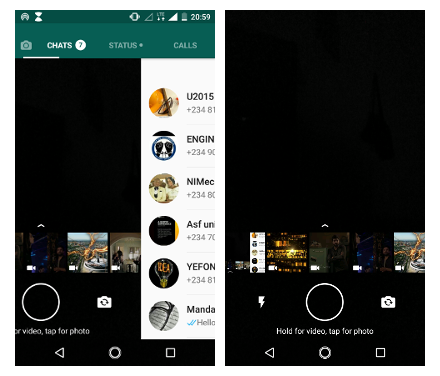
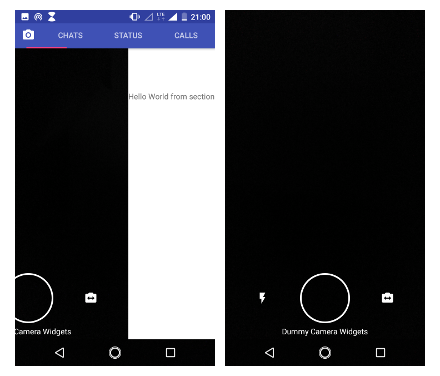

# Residing Tab View
A residing tab like WhatsApp's camera tab.

## Screenshots
Whatsapp's layout vs Residing Tab layout




## Table of Contents

- [Introduction](#introduction)
- [Demo](#demo)
- [Implementation](#implementation)
  - [Layouts](#layouts)
  - [Logic](#logic)
  - [Limitations](#limitations)
- [How to use](#how-to-use)
- [Contributing](#contributing)
- [License](#license)
- [Contact](#contact)


## Introduction
Having searched online for a way to design a tab like the WhatsApp's camera tab, with little to no success, I decided to implement my own solution to the problem. 
It involves placing/residing the View for the tab beneath the ViewPager (like the SurfaceView for the camera's preview), and returning a Fragment with a null View for that tabs position (revealing position) on the ViewPager.
The Views returned by the other Fragments would have a painted background to completely cover the residing View.

Another View which serves as the foreground for the residing View (like the camera's interface) is placed above it, but beneath the ViewPager. It slides in and out of position with the null View Fragment.
When the null view Fragment slides into position, the transparency of the ViewPager then reveals the residing view and its foreground beneath it.


## Demo
Download [demo](https://drive.google.com/file/d/1Uy015Cpx8BK5_o11nPuJZdG5pAPTsPZJ/view?usp=sharing) application.

## Implementation
The Following implementations were carried out in the layout and logic.

#### Layouts
The layout was divided into two for simplicity. The `activity_main.xml`, containing the `residing view` and `content_main.xml`, containing the `ViewPager` and `Residing foreground`.
The layout attribute `android:fitsSystemWindows` is used to determine which ViewGroups should draw under system decorations (`="false"`) and which views should not (`="true"`).

**1. activity_main.xml:**
The base View of this layout should be set to draw under system decorations.

The first child in the ViewGroup is the residing View (like the SurfaceView for the camera's preview).

The second child is the container (FrameLayout) for the main content. It should not be allowed to draw under system's decorations.
Within it the `main_content` layout is added using an `include` tag.

**2. content_main.xml:**
This is the main content of the layout. Its base View is a CoordinatorLayout to handle various materials design behaviours like ScrollingView behaviour and AppBarLayout scroll flags.

The first child in the residing foreground. It is drawn above the residing View, just like the WhatsApp camera's buttons.

The second child is a modified ViewPager (`RevealViewPager`) having the `AppBarLayout.ScrollingViewBehaviour`, and a negative top margin, enough to place its top at the top of the AppBar. 
The fragments are made to appear below the appBar by placing a positive top padding equal to the top margin of the ViewPager on the individual fragment.

The fourth child is a FloatingActionButton.

#### Logic
The structure of the logic can be divided into the implementation of two separate classes.

**1. A FragmentPagerAdapter:**
This overrides methods for returning a Fragment instance for every position on the ViewPager.
For the position where the camera tab would be located, a Fragment instance returning a null View in its onCreateView method will be returned.
The Views returned by the other fragments should have a colored background to completely cover the residing view.

**2. A modified ViewPager class (`RevealViewPager`):**
This is a subclass of the `ViewPager` class. It has an inner class that implements `ViewPager.OnPageChangeListener`. It serves the purpose of animating the AppBarLayout, the ResideForeground and FloatingActionButton. It is also responsible for setting the window states. It exposes an interface for different visibility changes of the Residing View. 
The class is applied internally to the ViewPager using its addOnPageChangeListener() method.

#### Limitations
The limitations of the current version include:

1. **Touch events**: The Residing View and its foreground are placed below the ViewPager. This is to ensure proper scrolling behaviour for the ViewPager.
When the ViewPager is in Reveal position, it dispatches touch events to the residing foreground and then the residing view.
As a result of the scrolling behaviour of the ViewPager, only simple click and longClick events might respond properly. 
For instance a HorizontalScrollView would not be able to scroll properly in the horizontal direction but a VerticalScrollView can scroll in the vertical direction.  
Views with complex touch implementations should be avoided in this version.

## How to use
To use this in developing a similar layout, you can fork this project and use the template provided.

**Step 1:**
Include the `RevealViewPager` class in your project either by;

**1.** Forking the latest version and adding it directly to your project (Might be necessary if you want to make some changes to the class).

**2.** Getting it from `jitpack` by including the maven url for jitpack in your project level `build.gradle` file.
```groovy
allprojects {
    repositories {
    
        maven { url 'https://jitpack.io'}
        // ...
    }
}
``` 
and including the following dependency to your app level `build.gradle` file.
```groovy
dependencies {
    
    implementation 'com.github.Goody-h:ResidingTab:v1.0.0'
    // ...
}
```

**Step 2:**
Design a layout using the provided design [template](/template). Make sure to use the `RevealViewPager` implementation of the `ViewPager`.

**Step 3:**
Create a new Activity and set a reference variable for the `RevealViewPager` and add a constant which would hold the position index of the residing view reveal tab.
```kotlin
// The reveal viewPager variable
private var mRevealViewPager: RevealViewPager? = null
    
// Constant holding the reveal position
private val REVEAL_POSITION: Int = 0
```
**Step 4:**
Get the reference to the `RevealViewPager` in the activity's `onCreate( )` method.
Pass a reference of the residing View and its reveal position to the ViewPager by calling `setResidingView( )`.
Set the views to be transformed; the appBar, residing foreground, FloatingActionButton, by calling `bindTransformedViews( )`.
Set a `ResideTabVisibilityChangeListener` on the RevealViewPager by calling `setOnResideTabVisibilityChangeListener( )` to make changes to the residing view and its foreground based on its visibility.
```kotlin
override fun onCreate(savedInstanceState: Bundle?) {
  mRevealViewPager = findViewById(R.id.container)
  
  mRevealViewpager?.apply{
    // ...
   setOnResideTabVisibilityChangeListener( object : RevealViewPager.OnResideTabVisibilityChangeListener { 
                  // ... 
        })                
    setResidingView(reside_content, REVEAL_POSITION)
    bindTransformedViews(appbar, reside_view_foreground, fab)
    
    // ...     
  }
}
```

**Step 5:**
Call the `initTransformer( )` method of the RevealViewPager after setting the initial tab position, 
and pass the `savedInstanceState` from the `onCreate( )` method to it, including an optional boolean parameter to perform initial transformations.
```kotlin
override fun onCreate(savedInstanceState: Bundle?) {
  mRevealViewpager?.apply{
    // ...
    bindTransformedViews(appbar, reside_view_foreground, fab)
    
    initTransformer(savedInstanceState, false)     
  }
}
```
**Step 6:**
Set activity callbacks on the RevealViewPager. In the activity's `onSavedInstanceState( )` call the `saveState( )` method off the RevealVIewPager, to persist transformation state.
In the activity's `onResume( )` or `onWindowFocusChanged( )` call the `updateUIVisibility( )` method off the RevealVIewPager, to make sure the systemUIVisibility is always correct.
```kotlin
override fun onSaveInstanceState(outState: Bundle?) {
    super.onSaveInstanceState(outState)
    mRevealViewPager?.saveState(outState)
}
    
override fun onWindowFocusChanged(hasFocus: Boolean) {
    super.onWindowFocusChanged(hasFocus)
    if (hasFocus) {
        mRevealViewPager?.updateUIVisibility()
    }
}
```
**Step 7:**
Create at least two fragments. One would return a null View in its `onCreateView( )` method. 
This is the Residing tab reveal fragment.
```kotlin
class ResideRevealFragment : Fragment() {
    
    override fun onCreateView(inflater: LayoutInflater, container: ViewGroup?,
                              savedInstanceState: Bundle?): View? {
        return null
    }
}
```
Other fragments should return a View with a colored background and a positive top padding equal to the negative top margin of the ViewPager, in order to place its children below the appBar. 
```xml
<!-- replace ViewGroup with required class -->
<ViewGroup 
    xmlns:android="http://schemas.android.com/apk/res/android"
    android:id="@+id/fragment_layout"
    android:layout_width="match_parent"
    android:layout_height="match_parent"
    android:background="@android:color/white"
    android:paddingTop="120dp">
    
    <!-- children -->
    
</ViewGroup>
```
**Step 8:**
Create a ViewPagerAdapter class and override its `getItem( )` method. 
Check if the requested position equals the position index of the residing tab reveal and return the null View Fragment else return any other Fragment.
```kotlin
class SectionsPagerAdapter(fm: FragmentManager) : FragmentPagerAdapter(fm) {
    
    override fun getItem(position: Int): Fragment {
        // Return a ResideRevealFragment if position = 0 else
        // Return a PlaceHolderFragment (defined as a static inner class below).
        return if (position == REVEAL_POSITION) ResideRevealFragment()
            else PlaceholderFragment.newInstance(position + 1)
    }
    
    // ...
}
```
Set the adapter for the ViewPager in the activity's `onCreate( )`
```kotlin
override fun onCreate() {
  mRevealViewpager?.apply{
    adapter = mSectionPagerAdapter
    // ...
  }
}
```

## Contributing
Contributions to this projects are welcomed. Contributions should be focused mainly on the current limitations of the project.  
Create a pull request indicating the new implementations to be made.

## License
This project is licensed under the Apache License Version 2.0, January 2004. Read the [license](/LICENSE) statement for more information.

## Contact
- Support: [orsteg.apps@gmail.com](mailto:orsteg.apps@gmail.com)
- Developer: [goodhopeordu@yahoo.com](mailto:goodhopeordu@yahoo.com)
- Website: [https://orsteg.com](https://orsteg.com)